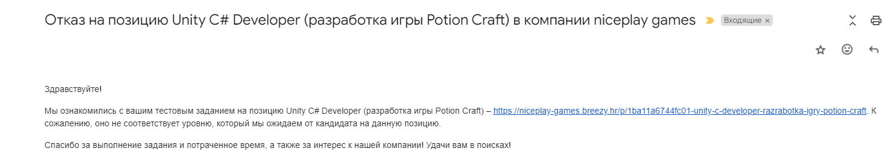

# Описание

Тут представлена моя попытка выполнения тестового задания на позицию Middle Unity Developer в команду PotionCraft.

[Описание ваканиси](vacancy.md)

[Техническое задание](Тестовое_задание–UnityDeveloper(PotionCraft).pdf)

Те кто хочет могут тоже посмотреть и оценить мой код или сами попробовать потренироваться в выполнеии тестового. На его выполнение давалось 2 недели.

**Внимание!**

Меня на эту вакансию не взяли, a значит вероятно моего решения недостаточно, (хотя возможно и просто не повезло с отбором)

**Дополнение**

Мне все-таки прислали фидбек по тестовому заданию. Мне кажется что в основном это всякие мелочи с многими из которых я не согласен, но тем не менее оффер я не получил...

Собственно недочеты были указаны следующие:
- Варнинги
- Не консистентное комментирование и форматирование кода
- Тонкие капсуль-коллайдеры вместо стен
- Объекты в разных Z координатах
- Используется инспектор для эвентов
- Не используются префаб варианты
- FindFirstObjectByType
- Множество вложенных ифов
- Сомнительное использование сборок